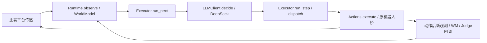

# 真实接线已运行；一球搬运未完成

**平台传感 → 同一 WorldModel → 真实 LLM → 既有 Executor → Actions → 平台新观测已实际接通。两局一球开发 demo 均 FAIL，双球阶段 1 为 NOT_RUN。** 本轮在一次针对真实反馈缺口的小修后停止，没有第三局、阶段 2、十布局或真机运行。

实际复用 [octos_robots `33af31baefc9b3beaa855f33849d52254aaa8c4b`](https://github.com/54dK3n/octos_robots/commit/33af31baefc9b3beaa855f33849d52254aaa8c4b) 的 `orchestrator.executor.Executor.run_next/run_step`，不是外部 Octos runtime。唯一任务循环仍在 `autonomous_brain.run`；Executor 技能注册/分发调用 `LiveOrchestration._execute → Actions.execute`，判定回调读取同一 Runtime 的新观测、WM、holding 和既有证据，`max_retries=0`。



模型为官方 `https://api.deepseek.com/v1` 的 **deepseek-flash，temperature=0，thinking=disabled**，沿用既有客户端及本机凭据加载。独立生成检查两次：首次格式错误；仅修正预检提示后第二次取得合法动作，两条原记录分别保留。这不是平台任务成绩，也不改写旧 HTTP 402 结论。

| 实际 map-05 开发局 | 完整轮 / 模型请求 | WM观测 / 桥observe | 桥调用 / 运动 | 仿真秒 | 观测链 / 物理交付 / done |
|---|---:|---:|---:|---:|---|
| smoke-01 | 64 / 65 | 311 / 312 | 1430 / 181 | 220.16 | 0 / 0 / 否 |
| smoke-02 | 55 / 67 | 294 / 295 | 1363 / 182 | 231.18 | 0 / 0 / 否 |

两局模型 lifecycle 的 started、finished 与完整调用记录数分别均为 65、67；合法动作输出为 65、56，不能用完整轮数代替调用数。两局均未实际发出 grab/release，脑端 DELIVERED=0、最终观测夹爪空、白名单外请求=0，导出完整且运行期间源码哈希不变。平台真值只在独立评测侧使用。一球使用明确的 smoke 评测入口，原 driver 的双球判据保留。

首局 r35 身份竞争阻止抓取；模型动作摘要遗漏授权失败与恢复理由。小修只补有界反馈和合法探索提示，未放宽安全门。第二局 r34 再遇竞争，随后模型确实选择探索并换位；r38 抓取仍因竞争被拒，缺少可恢复的确认视角，之后 `not_on_observed_road` 阻断行驶。当前直接阻塞是**保持身份唯一性前提下的有效重确认与安全归路**，未完成搬运。两局分别在 r65、r56 动作尾部有界中断；原 `summary.reason=not_started` 是默认残留，不能解释为未运行。观测数量差及严格回放尾部 FAIL 均保留，见 [smoke-01备注](SMOKE01_NOTES.md) 和 [METRICS](METRICS.json)。

冻结主仓源码：[首局 `6838a78c79af04d2e840c4a9d383924d63ef7644`](https://github.com/54dK3n/wm_bench/commit/6838a78c79af04d2e840c4a9d383924d63ef7644)、[第二局 `c351695f8c878e0923159d6be60d293d3c77979b`](https://github.com/54dK3n/wm_bench/commit/c351695f8c878e0923159d6be60d293d3c77979b)。恢复依赖和本机凭据后，下列真实入口会新建一局，不使用 mock 或回放；目前不再执行：

```sh
node tools/autonomous_brain_driver.js --maps map-05 --runs 1 \
  --platform-root workspaces/guangyang-platform/projects/car-python \
  --orchestrator-root workspaces/octos_robots \
  --task '把一个红球送到绿色存放区' \
  --out artifacts/autonomous-brain/octos-live-demo-20260927/raw/reviewer-one-ball-new
```

[原始关键帧：smoke-02 frame 202](https://github.com/54dK3n/wm_bench/releases/download/octos-live-demo-20260927-c351695/smoke02-frame202.png) · [完整证据 Release](https://github.com/54dK3n/wm_bench/releases/tag/octos-live-demo-20260927-c351695) · [恢复/复算](RESTORE.md)。每轮 `rounds.jsonl.orchestration` 串起 run/step、观测编号、WM状态哈希、真实调用编号、Executor分发、桥请求序号和动作后Judge；`METRICS.json` 另将编排UUID与平台native runId对应。历史 PASS/FAIL 和旧证据均不覆盖。
