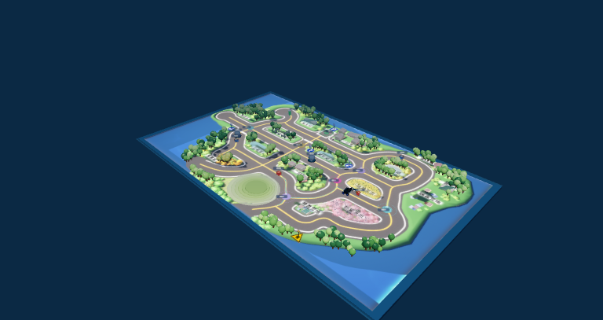
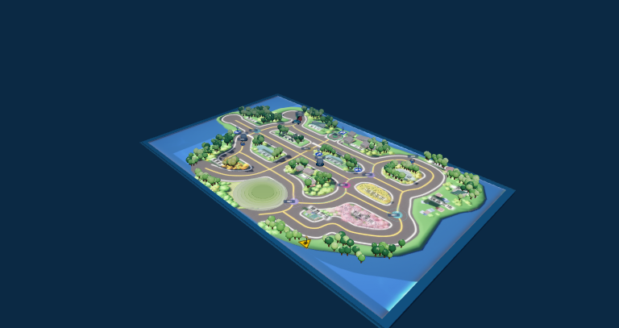

# 双目标 Demo · map-05

**原局通过**：同局两个不同目标完成抓取与送达；仿真 **440.60s ≤600s**，observe **27/92**，程序报错 **0**，两个球的固定规则均通过。完整门限见 [demo_report.json](demo_report.json)。本次只整理文档，不运行仿真、不替换原局。

## WorldModel 在这一局做了什么

| 球 / 实际包裹 | 观测进入 WM → 三次不同位置命中 | 确认 → 纯记忆导航 → 抓取 → 送达 |
|---|---|---|
| 1 / `guangyang-target-1` | 新观测建立 `target_001`；34.36s / 55cm → 38.24s / 49cm → 56.92s / 51cm | 56.92s 确认；到 186.38s 首次 approach 视觉步前，纯记忆行驶 895.7cm；188.26s 抓到；225.94s 送达 |
| 2 / `guangyang-target-2` | **位置来自新观测，不来自记忆**；328.08s 建立 `target_002`；328.08s / 46cm → 333.32s / 60cm → 337.38s / 69cm | 337.38s 确认；到 397.62s 首次 approach 视觉步前，纯记忆行驶 483.3cm；398.36s 抓到；439.06s 送达 |

每球三次命中属于同一条轨迹，原始读数均在固定窗口内。球1相邻位姿间距为24.14cm、43.04cm，球2为23.48cm、15.60cm，均≥15cm；最后确认点的WM距离分别为0.5554m、0.7998m，均≥0.5m。WM把三个观测位置融合成目标位置，确认后以该记忆位置导航；第二球开始时没有可选的旧记忆位置，继续巡逻后才由新观测建轨。

上表纯记忆里程由原生 odometry 累计距离差计算，区间内没有 observe 或 approach 视觉查询。之后各执行一次规则允许的 `approach(max_steps=1)`，调用时WM距离分别为0.219m、0.220m（≤0.25m）；全程onRoad。程序在 approach 前记录的净前进指标为871.7cm、476.7cm，均≥30cm。末次observe到实际抓取的总里程另为902.5cm、483.3cm，包含approach，不能混称全程无视觉的纯记忆导航。

所有时刻、命中、里程与原始索引由 [wm_story.json](wm_story.json) 保存；可从仓库根目录离线复算：

```sh
python3 tools/demo_wm_story.py
```

“首次看到”使用未封顶、精确渲染且唯一对应真球的记录；封顶100cm仅作为方位候选，不作为距离证据。原始帧与完整record仅本地保留，恢复方法见 [数据保留说明](../../../docs/DATA_POLICY.md)。

## 已提交的抓取与送达关键帧

截图在对应事件后取得，事件tick与截图tick分别列明。

| 球 / 事件 | 平台事件 tick | 截图 tick | 关键帧 |
|---|---:|---:|---|
| 球1 抓取 | 9413 | 9416 |  |
| 球1 送达 | 11297 | 11300 |  |
| 球2 抓取 | 19918 | 19919 |  |
| 球2 送达 | 21953 | 21956 |  |

## 已试失败布局

原始日志索引均从零开始，见对应 `map-XX.json` 的 `lines`。

| 布局 | 卡点及原始数值 |
|---|---|
| [map-03](map-03.json) | 第一球已送达，第二球确认失败。lines[3317] tick12300：`WorldModel 未通过 observe() 确认目标物`，delivered=1、queries=379、controls=124；lines[3281] `confirmation_failed` hits=0；末observe lines[3314] count=33、红=[]。 |
| [map-04](map-04.json) | 第一球已送达，第二球确认失败。lines[10364] tick25471：同上确认失败，delivered=1、queries=840、controls=230；lines[10348] hits=0；末observe lines[10361] count=54、红=[]。 |

## 冻结版本与复跑入口

原demo是 `wm-demo-v1-20260923`：[program.py](program.py) 的SHA256为 `58a24a2d4fb9bd6b564530eb74ef627a71c2084e731a815cf21f5cc9bb7c7928`；[实际执行源码](executed_program.py) 的SHA256为 `ee01a6161f0600422ec5bfdfaa7e8d7e832ff5a1802d4d247bbf6de7ab1947e6`。两者仅平台去除首尾空白的差异。

`59d8f617…` 对应 [opt-2 round-3 程序](../opt-2/round-3/program.py)，不是本页原demo。本次不做可选重跑或录屏。

原复跑入口（从仓库根目录执行，输出必须是新目录）：

```sh
python3 tools/reproduce_demo.py --demo-folder artifacts/inloop/demo --out artifacts/inloop/demo-reproduction-NEW
```

**当前入口会拒绝运行**：现有driver与原demo冻结清单不同。原driver的SHA为 `39df847b991c83660e0fd0e38741e6b3b53ca875f57069383c2b590adfaad8a1`，其原字节保存在 [冻结driver](../opt-2/round-1/frozen_sources/047-inloop_driver.js)。应在隔离副本中恢复原依赖再复跑，不覆盖当前driver，不绕过哈希校验。原局记录保持不变。
