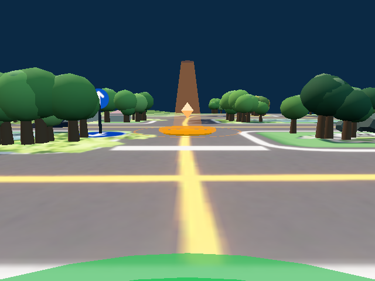
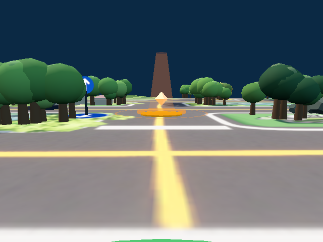

# C · 第 1 轮：未通过

本轮已完成全部布局，未开始第 2 轮或 D。当前没有找到有证据支持的纯重构修正；视觉输入的时间依赖属于平台行为问题，按 C 第 6 条先记录，不在本阶段修复。保留原 opt-2 round-3 基线及本轮失败记录，不以离线回放替代在环门限。

| 门限项 | 结果 | 证据 |
|---|---|---|
| map-01…map-10 各运行一次 | 10/10 完成；程序错误 0 | [执行台账](progress.json)、[逐条比较](behavior-equivalence.json) |
| 原生 inputs 逐条相同 | **0/10，FAIL** | [逐局表](behavior-equivalence.SUMMARY.md) |
| 原生 events 逐条相同 | **5/10，FAIL** | 同上 |
| 原生得分相同 | **8/10，FAIL** | map-05：46.2→43.1；map-08：43.1→46.2；同上 |
| 全部行为门限同时满足 | **0/10，FAIL** | [比较器](../../../../tools/compare_refactor_records.py)，未忽略帧编号、时刻或感知值 |
| 指定 pylint 错误为零 | PASS | [预检](preflight.json)、[pylint](pylint.txt) |
| AST 无重名函数定义 | PASS，重复定义 0 | [预检](preflight.json) |
| 真实 worker 启动冒烟 | 新程序及旧 round-3 通过；旧 round-2 被拦截 | [新程序](runtime_smoke.json)、[旧基线](runtime_smoke_baseline.json)、[反例](runtime_smoke_counterexample.json)：`NameError: OPT2_MEMORY_TRAVEL_ACTIVE` |
| 批跑期间源码冻结 | 273/273 文件未变 | [冻结校验](freeze_verification.json) |

预检另有 Python 630 项、Node 19 项全部通过，见 [Python 日志](tests.txt)及 [Node 日志](driver_tests.txt)。有效函数与类的 AST、运行常数及顺序检查见预检；这些检查不抵销在环 FAIL。

## 失败归因

所有布局的第一处真实差异都在 `observe` 返回值；此前请求、动作及记录的状态相同。没有仅因帧编号不同而失败的布局。[首差诊断](first-divergence.json)给出每个字段的旧值、新值和原始证据散列。

| 布局 | 首差 inputs 下标（从 0 起） | tick | events 相等 | 得分旧→新 |
|---|---:|---:|---|---:|
| map-01 | 4 | 0 | 是 | 40→40 |
| map-02 | 13 | 147 | 否 | 49.2→49.2 |
| map-03 | 491 | 6332 | 是 | 46.2→46.2 |
| map-04 | 4 | 0 | 是 | 43.1→43.1 |
| map-05 | 4 | 0 | 否 | 46.2→43.1 |
| map-06 | 4 | 0 | 是 | 55.4→55.4 |
| map-07 | 40 | 675 | 是 | 40→40 |
| map-08 | 79 | 1446 | 否 | 43.1→46.2 |
| map-09 | 4 | 0 | 否 | 46.2→46.2 |
| map-10 | 4 | 0 | 否 | 49.2→49.2 |

首帧诊断中，10/10 布局的车体、相机及包裹状态相同，但 PNG 相同为 0/10。用同一个当前像素检测器重算，20/20 张原 PNG 精确还原各自记录的检测结果，证明存在实际图像内容差异。map-05 在 tick 0 的检测数从 5 变为 4，少了 `obstacle / distanceCm=100 / bearingDeg=1.65 / confidence=0.83`；两图有 25,041 个像素不同。见 [视觉诊断](vision-diagnosis.json)。这不能单独证明该首帧导致了最终分数变化。

| map-05 旧局首帧原图 | map-05 本轮首帧原图 |
|---|---|
|  |  |

平台 `app.js` 的 `animateSceneEffects` 使用浏览器动画时钟改变可见检查点的高度、旋转和透明度；`captureVirtualCameraFrame` 直接渲染当前场景，没有把该动画固定到仿真 tick。图中检查点变化与此机制一致，但原局未记录完整动画相位，不能独占归因所有像素差异。旧 round-3 也没有完整锁定渲染源码及资源，因此不能声称两轮整个视觉环境逐字节相同。相机动画的修复及旧程序基线的重新建立均超出本次纯重构授权；在范围明确前暂停后续批跑，不消耗无修正依据的轮次。

为分离程序与感知输入差异，另用平台的 Pyodide 和真实 worker 包装离线回放旧局公共输入。10 局的旧、新程序每方 10,243 次 API 调用、493 个 WM 全状态快照相同；16,317 条 GY 日志也与旧局逐条相同，只归一 `program_version` 的四个代码身份字段。原生记录没有保存 `holding()` 返回，107 次调用使用逐项注明来源的公共日志及控制流补充，因此**不是完整原生输入回放，也不是 C 通过证据**。错误运动参数、WM 状态及标定参数等 6 项自检通过。见 [回放汇总](replay-summary.json)、[自检](replay-self-checks.json)。

## 程序与复算

`PROGRAM_VERSION=wm-refactor-r1-20260924`；[程序](program.py)文件 SHA256：`b31ed3b4c1ad4abe1a162526bdf07174e3259afc2d4d5c977b1e27e384e11381`。
平台实际载入去除末尾空白后的源码 SHA256：`62bdae0c2c241341599fba9d7d39bc67710fba8d98b1fdc071e4b1b695e12b6f`，见 [载入程序](executed_program.py)。
WorldModel 主仓提交：`fef0ba9b754ce9652836fdb720d1162dcadbc5ef`；嵌入包 SHA256：`f9dc27558c8670f06f01eec0b2a60e87085ef3f39134ab908e08bda1b97ba119`。

改动与删除见 [清单](../deletions.json)：模块源码统一在 `programs/src/`，构建按固定顺序拼接并注入常量；移除被覆盖定义及不可达函数；旧生成程序保留在原 artifacts。已发现的行为问题见 [待修清单](../bugs.json)，未修改。

本轮及旧对照的全部执行日志、record、samples 和帧随 [证据包](../evidence-packages/manifest.json)保存。在空目录恢复后重算，完整比较报告与本轮报告逐字节相同，仍为 FAIL；见 [恢复校验](../evidence-packages/restoration-check.json)。

在仓库根目录离线复算，不启动仿真：

```sh
# 新 clone 先恢复本轮及旧对照的完整原始证据。
python3 tools/package_refactor_evidence.py --restore
python3 tools/compare_refactor_records.py --candidate artifacts/inloop/refactor/round-1
python3 tools/refactor_first_divergence.py --candidate artifacts/inloop/refactor/round-1
# 平台路径由本机环境提供；下面只调用 PNG 解码和像素检测，不启动仿真。
python3 tools/refactor_vision_diagnosis.py --candidate artifacts/inloop/refactor/round-1
python3 tools/refactor_public_replay.py --all-maps --supplement-holding \
  --out artifacts/inloop/refactor/round-1/replay-summary.json
```

行为比较命令按原门限返回非零退出码是本轮的预期失败结果，不能改成通过。
